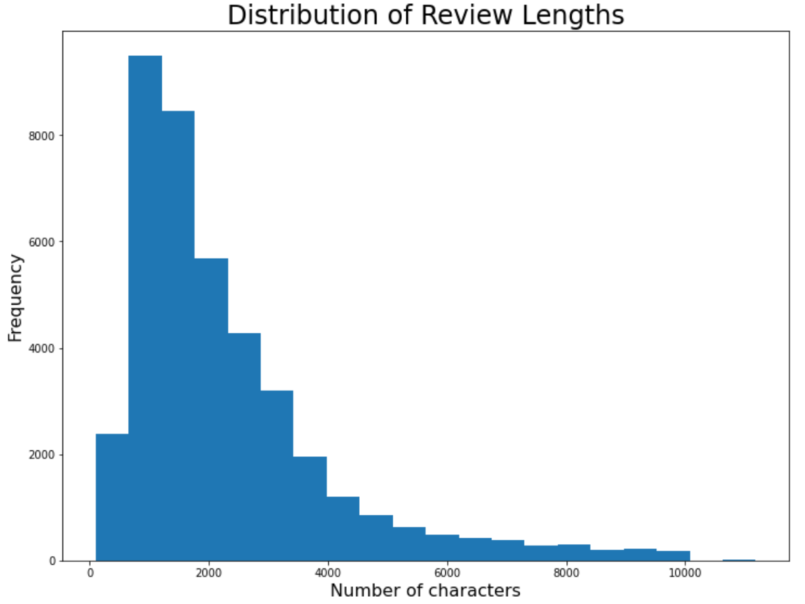
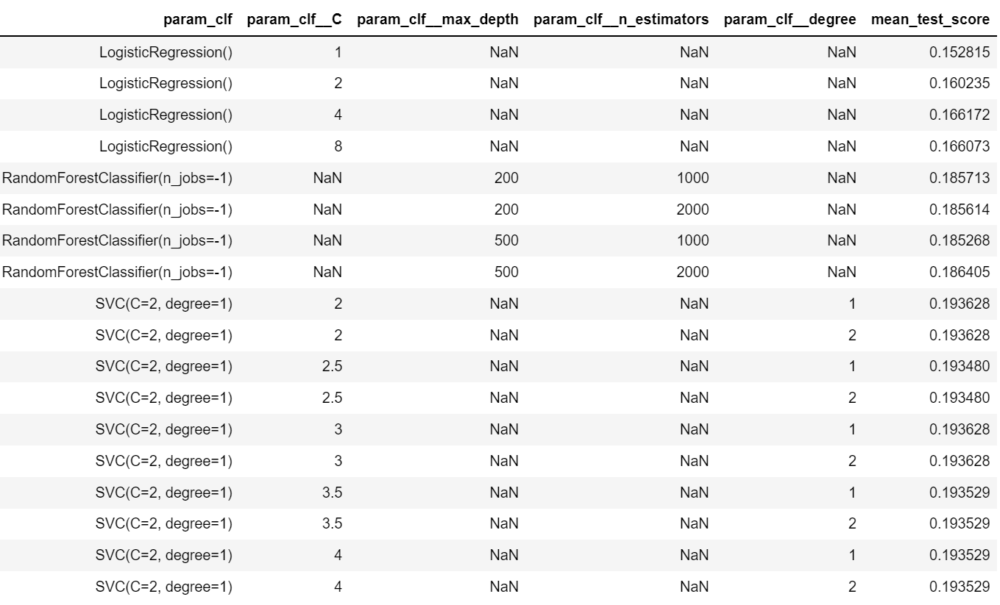

# Whisky Project

# Whisky Project

For the attention of Udacity reviewers: Please note that this project is not a blog submission, but an **application** submission. This repository contains the code needed for the web application hosted on Heroku. The repository containing the bulk of the background work and code for Whisky Project is to be found at [whisky_project](https://github.com/jamiepotter17/whisky_project).

## Summary

This is a natural language, machine learning project that classifies whiskies based on tasting notes provided by the user. It was trained on data harvested from Reddit's whisky community through Reddit's API.

## Instructions:

The completed app is hosted on Heroku at [https://whiskyproject.herokuapp.com](https://whiskyproject.herokuapp.com). Please go there to view the app.

To use, simply enter your tasting notes for the nose, palate, and finish of your whisky, and click 'Guess Whisky Brand'. For example, my review of a typical Laphroaig (my favourite whisky!) would be:

* Nose - medicinal, peat, smoky
* Palate - sweet, mint, liquorice, peat
* Finish - sweet, salty, long

## Background

This is the Capstone Project for Udacity's [Become a Data Scientist](https://www.udacity.com/course/data-scientist-nanodegree--nd025) Nanodegree Program. It was commenced on 2012-02-28. Here the brief was fairly open, but the essential idea was to follow the Data Science Process from start to finish on a project of my own design. That is, to:

1. **Define** the problem you want to solve and investigate potential solutions.
2. **Analyse** the problem through visualisations and data exploration.
3. **Implement** algorithms and metrics, documenting any preprocessing, refinement, and post-processing steps along the way.
4. **Collect results**, and draw conclusions about whether your implementation adequately addresses the problem.

The final project could be in the form of either a blog post documenting all of the steps from start to finish of your project, or a deployment of a web application (or something that can be run on a local machine).

## Aim

The aim of Whisky Project is to develop a web application that would allow users to enter tasting notes on a whisky, and then return a prediction on what whisky it was based on a whisky classifier trained from data gathered from Reddit.

## Data Gathering

The data I have gathered was taken from [Reddit's API](https://www.reddit.com/dev/api) using [PRAW](https://praw.readthedocs.io/en/stable/), a Python package that provides a useful wrapper when working with the API. A link to a list of reviews called the '[Whisky Review Archive](https://docs.google.com/spreadsheets/d/1X1HTxkI6SqsdpNSkSSivMzpxNT-oeTbjFFDdEkXD30o/edit#gid=695409533&fvid=484110565)' [Google Docs link] is made available on the [/r/whisky](https://www.reddit.com/r/whisky/) subreddit. I downloaded this spreadsheet file as a csv, and then augmented it as best I could so that the each row has the original review text included under the 'review' column.

The process of gathering the data can be seen in '1. Data Gathering.ipynb'. Unfortunately, due to file size constraints, it isn't possible to upload all the data gathered in this notebook, but the results of the gathering process are stored in gathering_complete.csv, and has the following distribution in terms of the length (in characters) of the review:

## Data Exploration and Cleaning

For the process of data exploration and cleaning, see '2. Data Exploration and Cleaning.ipynb'. Critical to the project was:

1. Matching the correct review to a particular whisky - not always obvious since a comment/submission would have multiple reviews in them.
2. Separating out the tasting notes for the nose, palate and finish of whiskies from the review, as this is the critical information needed for training the machine learning classifier.

To solve the matching problem, I first of all created a list of different ways of splitting up the 'review' comment/submission gathered from Reddit into a list of separated potential reviews. I then used an algorithm (fuzzywuzzy) that calculated the Levenshtein Distance between the name of the review we were looking for and the list of strings and selected the shortest distance. I then kept it if only mentioned 'nose', 'palate/taste' and 'finish' a certain number of times, thereby making it fairly likely I'd hit on the actual review.

Then, once this was done, it was simply a matter of using regular expressions to split the review up into the 'nose', 'palate', and 'finish' sections respectively. Unsurprisingly, a large number of rows in the original dataframe was lost in the process, as many 'reviews' turned out not to be reviews, and many turned out not to have easily recoverable separable sections for 'nose', 'palate' and 'finish'.

## Data Preprocessing

For the preprocessing steps  of data exploration and cleaning, see the latter stages of '2. Data Exploration and Cleaning.ipynb'.

I first of all had to create a new column in the dataframe called 'brand' which would match each row with a brand of whisky. Fortunately, this was made easier by the fact the data was already separated into regions, and I could find the brand of the whisky for each region in turn by simply constructing a brand list manually and demanding an exact match of one term in that list with a term in the full name of the whisky, checking the errors and updating as needed. This did mean that some 4000 or so rows were dropped, however - whiskies that were categorised in the wrong region, that were named incorrectly, that were too obscure, etc.

A final task before training a classifier could take place was creating a custom vocabulary list. Why did I do this? The main reason for doing this was to make the classifier honest - reviews will often include the name of the whisky itself. Whilst using this information does nominally improve the accuracy of the prediction (when I employed a pipeline without the custom vocabulary list, accuracy improved by 1-2%), it's information that I'm not expecting users to enter manually on the app, so it's superfluous. Worse, relying on such information could mean the machine learning algorithm ends up missing proxies that it _could_ have picked up if it were trained to look only for tasting notes. I wasn't out to produce a classifier that was maximally accurate - I wanted one that was maximally accurate _given that users were inputting tasting information_. Thus, a custom vocabulary list was needed. A second, minor reason for doing this is that it improves the speed and efficiency of the algorithm.

To create the vocabulary list, I created a tokeniser and stemmer that created a master list of all the stems used across the reviews I'd collected, and then went through them manually, 1000 at a time. My aim was to keep taste-related terms - adjectives, adverbs, and metaphorical nouns, and I was fairly liberal in terms of what I included.

## Model Implementation and Refinement

The model uses three countvectorizers in parallel on the nose, palate and finish sections of the dataframe, each of these countvectorizers themselves using my custom tokeniser function. These are then concatenated using featureunion, run through a TfIDF transformer, and finally a classifier.

The dataset was split 80:20 randomly into training and testing sets, and I tested RandomForestClassifier, KNeighborsClassifier, SVC, GaussianProcessClassifier, DecisionTreeClassifier, MLPClassifier, AdaBoostClassifier, GaussianNB, QuadraticDiscriminantAnalysis, LogisticRegression, and SGDClassifier with default values to get a sense of which ones would be best to have a go at fine-tuning. SVC, logistic regression and random forest came out well, but SGD and MLP also did fairly well. But because I didn't want a grid search taking forever, I ended up just looking for the best version of SVC, logistic regression and random forest, tuning each of them by adjusting their hyperparameters and carrying out a grid search just on the training set.

In this task, and when performing a grid search (where I used scoring='accuracy'), I was evaluating the performance of the pipeline on accuracy. Why accuracy? Well, there wasn't any particular reason to weight type I or type II errors differently. I just wanted an algorithm that maximised the probability of guessing correctly, and that's what accuracy is.

## Results and Conclusions

Initial classifiers on default settings gave the following scores for accuracy when tested on the 20% testing set:

| Classifier | Accuracy |
|:------|:--:|
| RandomForestClassifier | 19% |
| KNeighborsClassifier | 6% |
| SVC | 19% |
| GaussianProcessClassifier | - |
| DecisionTreeClassifier | 14% |
| MLPClassifier | 16% |
| AdaBoostClassifier | 4% |
| GaussianNB | - |
| QuadraticDiscriminantAnalysis | - |
| LogisticRegression | 17% |
| SGDClassifier | 15% |

The grid search returned the following values for accuracy within the grid search cross validation method (i.e. not on the testing set, but within the training data):

Thus, after performing a grid search with a range of fine-tuning options for the hyperparameters for support vector machine, logistic regression and random forest classifiers, it turns out that a support vector machine classifier with hyperparameters 'degree=1, C=2' gives the highest accuracy. When this was tested on the testing data, it gave a final score of 21% for accuracy.

It is fair to say that the classifier is not particularly accurate. It does not reliably identify the correct brand of whisky when given notes by the user. Two things, however, must be borne in mind here to put this result in context:

1. Taste is an inherently subjective phenomenon, an interaction between a particularly-situated human subject and objective reality. Furthermore, describing those sensations is nothing short of an art form that requires years of dedicated practice to master. Novel whisky tasters will struggle to identify notes beyond very obvious ones such as 'tar', 'smoke', 'vanilla', 'smooth', 'dry', whereas experienced whisky tasters will use a vocabulary that consistently distinguishes, say, 'spearmint' from 'peppermint', 'barley sugar' from 'cane sugar', etc. The point here is that there's a hard limit to how much signal there will be in a training set such as this because anyone can post a review to Reddit, and there's no such thing as a 'wrong review'.

2. Many whiskies _just are_ incredibly similar and will outstrip our ability to describe them. You will struggle in vain to detect differences reliably between many Speyside and Highland malt whiskies, for instance. Even if you can reliably identify a particular whisky (e.g. in blind taste tests), that doesn't necessarily mean you will be able to describe the difference. The notes sometimes just are very similar indeed.

Thus, I wasn't expecting a very high accuracy score going in. I was mainly interested to see _just how much_ signal there was in all the tasting notes, and I think it's fair to say that actually there is quite a bit of signal. Looking at tasting notes does indeed tell you quite a bit about what whisky it is. You probably won't know exactly which one it is, but you won't be far away. This aligns with informal feedback on the app I've had from people who know their whisky. Even when the guesses are wrong, the guesses make sense given the tasting notes people have been putting in. The model is producing a multi-dimensional matrix where the Euclidean distance does seem to correspond more or less to one's intuitive sense of which whiskies are similar to each other, which is a good sign.

## Evaluation

In terms of overall evaluative remarks concerning my project, I'm reasonably satisfied with my app. I set out hoping to produce a machine learning algorithm that would guess a whisky based on tasting notes given by the user, and I've successfully got that application up and running. I'm also quite happy with my 3-d scatterplot visualisation where you can see similar whiskies as it's quite a nice way of visualising which whiskies are similar.

The big thing to talk about is that overall accuracy score of 21%, though. I'm wondering how much things could be improved with:

* Better parsing of the review data in the first place. I did my best to match the reviews correctly, but doubtless there will be some noise introduced by the algorithms I ended up using.
* A more sophisticated NLP model that uses different ngram lengths. I created my own vocabulary list and basically just looked for adjectives and nouns that are often used in metaphors, but that is obviously still quite reductive. A more sophisticated natural language model could probably detect more signal than I was able to.
* Separating by expression. I introduced a lot of noise into the data by separating the whiskies into their brands. Really, however, this is a big simplification. There are often very big differences between different bottlings from the same distillery. The main reason I didn't pursue looking at each expression (e.g. Laphraoig 10, Laphroaig Cask Strength, Laphraoig Quarter Cask, etc.) was that I'd have ended up with far too many sparsely populated classes and it would have been very difficult to train any algorithm at all.
* Incorporating data from other sources. I used Reddit's reviews, but there's no particular reason I couldn't adapt things to include reviews from other sources. I suspect that we'd need reviews in the hundreds of thousands before we'd get to the point where we'd be able to distinguish between different expressions at the same distillery.

In terms of the front end and presentation, I've kept things simple, but there's clearly room for improvement there as well. Things work rather better on larger devices than on mobile, I've noticed. As someone with minimal experience of web development, I'm vaguely aware that trying to get things to work well on all viewports is something of a nightmare, but it's an area that definitely needs looking into.

There's lots of additional content I'd like to include in future:

* User prompt for a particular whisky, and it produces the 3d Scatter for similarity, and a word cloud about that particular whisky.
* Build in more visualisations about the Reddit dataset. I didn't include any information on ratings, for instance, because it needs cleaning up and time was an issue, but that would be interesting.

## File list:

* README.MD - this file.
* branded.csv - csv file ready to be fed into ML algorithm.
* distances.csv  - csv file with Euclidean distances between the whiskies. Use index_col = ['brand','distance_type'] to open as it has a multi-index.
* ./static/images/whiskies.jpg - picture of Brora whiskies I took whilst visiting the fine distillery at Clynelish. Sadly, I've still not tasted any Brora myself.
* ./templates/master.html - the landing page of the app where you enter your notes. Also displays the graphs showing summary info about training set.
* ./templates/go.html - will display the result of the model prediction and then a 3d scatterplot showing other whiskies with (nose distance, palate distance, finish distance) coordinates so you can identify similar whiskies.
* graphs.py - module that contains the visualisations to be loaded in.
* all_whisk_clf.py - module that contains function for loading in the whisky classifier model.
* nltk.txt - instruction to heroku to download stopwords from nltk.
* Procfile - instruction to heroku so it knows what to run.
* requirements.txt - contains only the requirements for a minimal virtual environment needed to run the app.
* run.py - the main file that gets run. Use 'python run.py' to host locally.
* gridsearch.png - image used in the readme
* reviewlengths.png - image used in the readme
